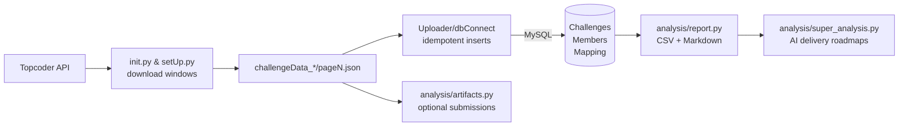

# DataCollector

Utilities for downloading Topcoder challenge metadata to JSON, performing
idempotent ETL into MySQL, and generating analysis-ready CSV/Markdown artifacts.

## Step-by-step runbook

**Before you begin:** inflate the oversized assets (Topcoder legacy archive + processed tasks CSV) that are stored as `.gz` files to satisfy GitHub's 100 MB limit. Run:
```bash
python scripts/unpack_large_assets.py
```
The script is idempotent and only writes files that are missing, so it is safe to run multiple times or after pulling updates.

1. **Create/activate the virtual environment**
   ```bash
   cd /Users/karanallagh/Desktop/DataCollector
   python3 -m venv venv              # already present, but re-create if needed
   source venv/bin/activate          # use venv\Scripts\activate on Windows
   pip install -r requirements.txt
   ```
   After activation, `which python` should report `/Users/karanallagh/Desktop/DataCollector/venv/bin/python`. If it still points anywhere under `Downloads/`, remove any lingering shells and re-source the environment to pick up the corrected path.

2. **Provision MySQL and set credentials**
   - Create a schema (default `dataCollector_v2`) in your MySQL instance.
   - If you're using Docker/Colima locally, the repo ships a helper that verifies Docker access and bootstraps the container:
     ```bash
     python scripts/mysql_up.py --wait
     ```
     If the script reports permission issues, start Colima from a privileged shell (`colima start --cpu 2 --memory 4`, then `docker context use colima`) before retrying.
   - Export credentials so every script can find them (`.env` is supported as well):
     ```bash
     export TOPCODER_DB_HOST=localhost
     export TOPCODER_DB_PORT=3306
     export TOPCODER_DB_USER=root
     export TOPCODER_DB_PASSWORD=your_password
     export TOPCODER_DB_NAME=dataCollector_v2
     ```
   - Optional overrides: `TOPCODER_DB_TABLE_CHALLENGES`, `TOPCODER_DB_TABLE_MEMBERS`, `TOPCODER_DB_TABLE_MAPPING`.

3. **Configure API access**
   - `TOPCODER_API_BASE_URL` defaults to `https://api.topcoder.com/v5`.
   - Set `TOPCODER_BEARER_TOKEN=<token>` if you want submissions/artifacts (registrants are public).

4. **Download challenge JSON**
   ```bash
   # Single ad-hoc window
   python init.py ./challenge_data 2023-01-01 2023-01-31 -st Completed -tr Dev

   # Fully automated yearly sweep (downloads + ingestion per month)
   python automation.py --year 2023 --status Completed --storage ./challenge_data --track Dev
   ```
   The downloader writes `challenge_data/challengeData_<start>_<end>/pageN.json`, already normalised via `process.format_challenge`.

5. **Ingest JSON into MySQL**
   ```bash
   python -c "from uploader import Uploader; Uploader('challenge_data/challengeData_2023-01-01_2023-01-31')"
   ```
   `Uploader` fetches registrants + submissions (using your bearer token when set) and fills the three core tables. It automatically skips members that were recently updated unless `TOPCODER_FORCE_REFRESH_MEMBERS=true` or `--force-refresh-members` was passed to `automation.py`.

6. **(Optional) Convert legacy Excel exports**
   ```bash
   python legacy_excel_loader.py old_Challenges.xlsx \
     --output-dir challenge_data/legacy_excel \
     --window-name legacy_archive \
     --output-file page1.json
   python -c "from uploader import Uploader; Uploader('challenge_data/legacy_excel/challengeData_legacy_archive')"
   ```

7. **Generate analysis artifacts**
   ```bash
   python analysis/report.py \
     --challenge-dir challenge_data \
     --member-mapping snapshots/Challenge_Member_Mapping.csv \
     --output-dir analysis/output
   python analysis/super_analysis.py --input analysis/output/ai_feasibility_analysis.csv
   ```
   The first command emits CSV/Markdown summaries (ai/non-ai, per-track/status, AI feasibility, submission stats). The second command produces delivery roadmaps (`ai_super_analysis.*`) reusing the AI feasibility CSV.

8. **Feed research/agentic pipelines (optional)**
   ```bash
   python scripts/export_real_tasks.py --challenge-dir challenge_data --output-dir data/raw
   python -m src.data.preprocess --raw-dir data/raw --output-dir data/processed
   make decomp_benchmark   # or make decomp_all for the full suite
   ```

9. **Regenerate table snapshots / Excel exports**
   ```bash
   python dbConnect.py --export-table challenges
   python dbConnect.py --export-table members
   python dbConnect.py --export-table challenge_member_mapping
   ```

10. **Validate the environment**
    - Run unit tests with `pytest -q`.
    - Spot-check downloads using `python init.py ...` and tailing `challenge_data/**/page1.json`.
    - Confirm MySQL tables are populated (`mysql -u root -p -e "SELECT COUNT(*) FROM Challenges;" dataCollector_v2`).

## Real-world Topcoder benchmark

We ship a real Topcoder SRM API benchmark under `experiments/real_repo_tasks/topcoder` that exercises the live `tc-template-node-postgres` repository. Each task includes a manifest (`task.json`), `ground_truth.patch`, and per-task tests under `experiments/real_repos/tc-template-node-postgres/test/*.spec.js`. The consolidated manifest lives at `experiments/decomposition/topcoder_repo_manifest.jsonl` and the summary stats land in `reports/repo_analysis/topcoder_task_pack_summary.{json,md}`.

- **One-command prep + run** — use the helper below to validate the provider, prepare workspaces (`npm ci` via setup metadata), and optionally launch the benchmark with multiple strategies:
  ```bash
  LLM_PROVIDER=ollama LLM_MODEL=llama3 \
    python scripts/prepare_real_repo_benchmark.py \
      --mode real_world_research \
      --strategies contract_first,failure_mode_first
  ```
  Pass `--prep-only` to stop after the setup stage (useful for offline dependency installs) or `--task-root` to point at a different manifest root.
- **Preflight + readiness** — a detailed preflight report (provider/model validation, Ollama health check, runtime tool availability, ground-truth coverage) is written to `reports/decomposition/real_world/real_repo/preflight_report.{json,md}` before any strategies are invoked.
- **Workspace prep** — every task now carries `runtime_family`, `package_manager`, `setup_commands`, `requires_network`, and `setup_timeout_sec`. The harness runs `npm ci --no-audit --no-fund` once per strategy workspace, captures stdout/stderr under `runs/<task>/<strategy>/logs/setup_*.log`, and injects the setup status into benchmark metrics.
- **Ground-truth localization** — `ground_truth.patch` is parsed to recover the touched files. Benchmark outputs now include both plan-vs-edit localization metrics and ground-truth precision/recall so you can tell whether a strategy edited the correct files even when tests continue to fail.
- **Results** — structured CSV + Markdown summaries live under `reports/decomposition/<mode>/real_repo/`. Each row includes provider metadata, setup outcomes, candidate retrieval stats, localization precision/recall, ground-truth overlap, and log paths for reproduction.

## Architecture & Flow



Core modules:

- `init.py` – CLI for single-range downloads (validates dates, storage paths).
- `setUp.py` – normalises args, hits discovery API with retries, writes preview `demoData.json`, and calls `fetch_functions.get_data`.
- `fetch_functions.py` – shared retrying HTTP client, paginated challenge fetch, registrant/submission/member helper calls.
- `process.py` – schema normalisation used by both ETL and analysis layers.
- `uploader.py` + `dbConnect.py` + `schema_registry.py` – idempotent inserts with `ON DUPLICATE KEY`, automatic migrations, member cache TTL/force refresh guardrails.
- `automation.py` – monthly backfill runner producing contiguous, gap-free windows with optional cache overrides.
- `analysis/report.py`, `analysis/artifacts.py`, `analysis/super_analysis.py` – research-grade reporting stack (CSV, Markdown, AI-feasibility heuristics, artifact inspection, delivery roadmaps).

## Workflow RL Pipeline

We added a parallel, trace-aware workflow RL stack that keeps the legacy task-selection simulator untouched.

- **Environment** – `src/rl/workflow_env.py` implements a Gymnasium-compatible workflow controller with action masking, trace logging, budgets (tokens/steps/retries), uncertainty features, and shaped rewards.
- **Agents** – `src/rl/workflow_agents.py` ships deterministic baselines (always-direct/decompose, heuristics) plus contextual bandits, Double DQN, and Dueling Double DQN with replay buffers, target networks, checkpointing, and action masking.
- **Experiments** – `experiments/run_workflow_rl.py` orchestrates all agents, ablations (disabling uncertainty, verifier/retrieval/decomposition, etc.), evaluation modes (unconstrained/fixed-token/fixed-step), CSV exports, and ASE 2026-ready figures/tables under `results/workflow_rl` and `reports/ase2026_workflow_rl`.
- **Reproducibility** – every run snapshot is logged to `results/workflow_rl/config_snapshot.yaml`, episodic traces land in `episode_logs.jsonl`, and lightweight unit tests cover action masking/reward/terminal transitions.

Quickstart:

```bash
# Run the full workflow RL suite (adjust --episodes for longer sweeps)
python experiments/run_workflow_rl.py --episodes 25 --ablation-episodes 10 --budget-episodes 10

# Smoke-test the environment primitives
pytest tests/test_workflow_env.py

# Automate STRIDE sweeps for teacher + override variants
python scripts/run_stride_suite.py --variants stride_without_uncertainty_features stride_gate_plus_residual --episodes 32 --seeds 0 1 2 3 4

# Run TARL and AEGIS automation helpers (small episode counts shown)
python scripts/run_tarl_suite.py --episodes 20 --episodes-per-agent 16
python scripts/run_aegis_suite.py --episodes 8 --episodes-per-agent 16 --use-reduced-actions
```

Outputs land in `results/workflow_rl/*.csv` for automation pipelines and `reports/ase2026_workflow_rl/*` for the paper bundle (summary markdown, tables, PNG figures, paper notes).

## Prerequisites

- Python 3.10+
- MySQL instance reachable with credentials you control
- `pip install -r requirements.txt`
- (Optional for tests/dev) `python -m pip install pytest`

## Environment variables

| Variable | Purpose | Default |
| --- | --- | --- |
| `TOPCODER_API_BASE_URL` | Topcoder API root | `https://api.topcoder.com/v5` |
| `TOPCODER_BEARER_TOKEN` | Required for submissions/artifacts | _none_ |
| `TOPCODER_STORAGE_DIR` | Default download directory | _unset_ |
| `TOPCODER_DB_HOST` / `TOPCODER_DB_PORT` / `TOPCODER_DB_USER` / `TOPCODER_DB_PASSWORD` / `TOPCODER_DB_NAME` | MySQL connectivity | `localhost` / `3306` / `root` / `password` / `dataCollector_v2` |
| `TOPCODER_DB_TABLE`, `TOPCODER_DB_TABLE_CHALLENGES`, `TOPCODER_DB_TABLE_MAPPING`, `TOPCODER_DB_TABLE_MEMBERS` | Optional table overrides | see schema |
| `TOPCODER_FORCE_REFRESH_MEMBERS` | `true/false` to bypass cache | `false` |
| `TOPCODER_MEMBER_CACHE_TTL_HOURS` | Re-fetch members older than N hours | `720` |
| `LLM_PROVIDER`, `LLM_MODEL` | Decomposition provider + model (`mock`, `openai`, `azure_openai`, `anthropic`, `ollama`) | `mock` / `mock-model` |
| `OLLAMA_BASE_URL`, `OLLAMA_MODEL` | Override Ollama host/model when `LLM_PROVIDER=ollama` | `http://127.0.0.1:11434` / `llama3` |
| `LLM_TOKEN_BUDGET`, `LLM_TIME_BUDGET_SECONDS` | Global token/time caps for decomposition plans | unset (infinite) |
| `DECOMP_MOCK_MODE` | Force mock LLM responses (`1`/`0`) | `1` |

## CLI Workflows

### Single range download

```
python init.py <storage_dir> <start-date> <end-date> [-st STATUS] [-tr TRACK]
```

Example:

```
python init.py ./challenge_data 2023-01-01 2023-03-01 -st Completed -tr Dev
```

JSON pages are written to `challengeData_<start>_<end>` and can be ingested later.

### Upload to MySQL

```
python -c "from uploader import Uploader; Uploader('<path/to/challenge_data>')"
```

The uploader remains idempotent through `INSERT ... ON DUPLICATE KEY UPDATE` and honours member cache TTLs.

### Automated backfill

```
python automation.py \
  --year 2023 \
  --status Completed \
  --storage ./challenge_data \
  --track Dev \
  [--force-refresh-members] \
  [--member-cache-ttl-hours 24]
```

`Automation` generates contiguous monthly windows (Jan 1 → Dec 31) without gaps or overlaps, runs downloads per window, and immediately ingests them.

### Legacy Excel ingestion

Older Topcoder exports (e.g. `old_Challenges.xlsx`) can be normalised and uploaded with:

```
python legacy_excel_loader.py /path/to/old_Challenges.xlsx \
  --output-dir challenge_data/legacy_excel \
  --window-name legacy_archive \
  --output-file page1.json
```

The script converts the legacy sheet into the same structure produced by `format_challenge`, so `Uploader` and the reporting stack can work with the generated JSON (`challenge_data/legacy_excel/challengeData_legacy_archive/page1.json`) without any changes.

To feed these historical challenges into the research/decomposition stack:

```
python scripts/export_real_tasks.py --challenge-dir challenge_data/legacy_excel --output-dir data/raw
python -m src.data.preprocess --raw-dir data/raw --output-dir data/processed
make decomp_all
```

`export_real_tasks.py` synthesises the `data/raw/tasks.csv`, `workers.csv`, and `interactions.csv` tables expected by `src/data/preprocess.py`. Once `data/processed/*.parquet` is refreshed, the decomposition runners (`make decomp_all`) will use the real tasks for their “real slice” and downstream supervised/RL analyses.

### Universal Agent / Topcoder experiment

The universal agent routes heterogeneous Topcoder tasks (algo coding, repo/API, architecture docs, ETL specs) to specialised solvers with deterministic verifiers and Reflexion memory. A presentation-grade demo run looks like:

```bash
# Solve a mixed sample (routes, verifiers, Reflexion memory all enabled)
venv/bin/python tools/run_topcoder_experiment.py \
  --presentation \
  --sample-size 30 \
  --run-id universal_demo_v3 \
  --llm-provider openai \
  --rate-limit 0.2 \
  --no-cache

# Summarise gating metrics (algo/non-algo mix, self-check stats, LLM usage)
venv/bin/python tools/summarize_topcoder_run.py --run-id universal_demo_v3
```

#### Universal output schema & sentinels

All solvers now emit a single JSON object wrapped by literal `BEGIN_JSON` / `END_JSON` sentinels. The schema is fixed: `{task_type, id, title, summary, assumptions[], plan[], artifacts{}, validations[], confidence, stop_reason}`. `artifacts` fan out per task type (e.g., repo tasks require `patch_diff_unified`, `file_plan`, `risks`, `test_plan`; ETL tasks require `pipeline_spec`, `sql_snippets`, `python_snippets`, `data_quality_checks`; architecture docs require `design_doc_md`, `mermaid_diagram`, `interfaces`, `tradeoffs`). When a task is non-actionable the agent still returns the same object with `task_type="non_actionable"` and `artifacts.reason` / `artifacts.what_needed[]`. Missing info must be called out inside `assumptions` + `stop_reason` rather than eliding keys, which keeps downstream JSON extraction deterministic.

Artifacts are written to `reports/experiments/<run-id>/`:

- `deliverables/` and `patches/` capture non-algorithmic outputs scored via deterministic rubrics.
- `unit_tests/` records self-verify traces, with `self_check_*` fields separating synthetic “self-checks” from true pass@final.
- `checkpoint.jsonl` + `per_problem.csv` now include routing decisions, solver/verifier names, memory hints, and Reflexion history for each problem.
- `final_results.md` highlights `actionable_attempted_total`, `non_actionable_total`, self-check vs pass@final, deliverable success rate, and the new `llm_calls_per_attempted` gate so denominators are unambiguous.

Mock provider presentation runs automatically relax the LLM-call gate and are flagged as `run_validity=DEMO_ONLY_MOCK` so the summary clearly states “Gates relaxed for mock provider; not comparable to real-provider results.” Run the demo with:

```bash
venv/bin/python tools/run_topcoder_experiment.py \
  --presentation \
  --sample-size 30 \
  --run-id universal_demo_combined_mock \
  --llm-provider mock \
  --rate-limit 0.2 \
  --no-cache
```

OpenAI (or other real-provider) demos keep the default minimum `--min-llm-calls-per-attempted=0.5` gate, which is computed strictly as `llm_calls_total / actionable_attempted_total`. A typical command looks like:

```bash
venv/bin/python tools/run_topcoder_experiment.py \
  --presentation \
  --sample-size 30 \
  --run-id universal_demo_combined_openai \
  --llm-provider openai \
  --rate-limit 0.2 \
  --no-cache
```

The CLI also exposes `--min-llm-calls-per-attempted` (auto-set to 0.5 for real providers) and `--min-llm-calls-per-attempted-mock` (default 0) so you can fine-tune the gate without editing code.

`tools/summarize_topcoder_run.py` enforces a “satisfactory run” gate: LLM calls must be non-zero and presentation runs must cover a healthy mix of algo and non-algo tasks with deliverable artifacts. The script prints actionable reasons if the gate fails.

#### Recent Change — 2026-03-05

- Presentation gate reporting now distinguishes sampling artifacts (e.g., random 15-task samples producing only two algo problems) from true regressions. Random undersampling no longer turns the run red; instead, the summary emits a GREEN run with `presentation_gate_status=WARN_INSUFFICIENT_SAMPLE` plus analyst-facing guidance on increasing `--sample-size` or temporarily disabling `--presentation` when validating truncation fixes.

## Database schema guarantees

Migrations (run automatically by `dbConnect`) enforce primary keys on challenges and members plus unique `(challengeId, memberHandle)` constraint on the mapping table. Reruns update rows in-place instead of duplicating—the pipeline is safe to re-run.

## Analysis pipeline

```
python analysis/report.py \
  --challenge-dir ./challenge_data \
  --member-mapping snapshots/Challenge_Member_Mapping.csv \
  --output-dir analysis/output \
  [--from-api --start-date 2023-01-01 --end-date 2023-03-01] \
  [--download-artifacts --artifact-dir analysis/artifacts_store]
```

Outputs include challenge CSVs with AI autonomy/effort heuristics, monthly aggregates, and Markdown summaries. Optional artifact inspection augments these reports with submission-language metadata.

## Testing

```
python -m pytest
```

Tests cover schema normalisers, automation windows, HTTP retries, RL environments (including hardening), decomposition lab smoke tests, and the new budgeting/multi-agent plumbing.

## Task Decomposition Lab

The Task Decomposition Lab now operates over a 50-task curated benchmark spanning array/string/graph/DP/greedy/number-theory/mixed categories with explicit `split` annotations (`train`/`test`/`ood`) and at least ten hard/OOD variants. Each task carries pitfalls, canonical inputs/outputs, and reference solutions for reproducibility.

Seven strategies (contract-first, pattern+skeleton, failure-mode-first, multi-view, semantic diff, role-decomposed, simulation-trace) share the interface in `src/decomposition/interfaces.py` and are discoverable via `src/decomposition/registry.py`. Strategy runs log comparable metrics (pass-rate, decomposition steps, tokens, planning time) into `reports/decomposition/strategy_comparison.csv` alongside task metadata (`type`, `difficulty`, `pitfalls`, `split`).

LLM/toolchain calls route through `src/providers/llm.py`, which enforces opt-in token/time budgets (`LLM_TOKEN_BUDGET`, `LLM_TIME_BUDGET_SECONDS`). When a budget is exceeded the provider returns `{"budget_exceeded": true}` and strategies fall back to lightweight heuristics while still recording `tokens_used` and `planning_time` for downstream cost-quality analyses. Responses are cacheable/replayable so you can hook in a real provider later without rewriting planners.

### Make targets & reproducible commands

```
make decomp_benchmark                      # run all strategies, refresh CSV/MD reports
make decomp_rl                             # single-seed RL smoke (tune EPISODES/HORIZON)
make decomp_rl_seeds SEEDS=30 EPISODES=200 # multi-seed RL, then aggregate CIs
make decomp_multiagent SEEDS=10            # simultaneous policies + market stats
make decomp_meta                           # train base meta-selector
make decomp_meta_audit                     # train + leakage audit + leave-one-type-out
LLM_TOKEN_BUDGET=3000 LLM_TIME_BUDGET_SECONDS=30 make decomp_frontier
make decomp_real                           # run strongest strategies on a real/synthetic slice
make decomp_all                            # end-to-end: benchmark → RL seeds → multi-agent → meta → frontier → real slice → evaluation
```

Generated artifacts land in `reports/decomposition/`, including:

- `strategy_comparison.csv` / `.md` – per-task metrics with tags/pitfalls/split.
- `cost_vs_quality.csv`, `cost_frontier.{csv,md}` – aggregated diagnostics and Pareto frontiers.
- `ablation_by_task_type.csv`, `per_type_results.csv` – per-type/difficulty breakdowns.
- `rl_decomposition_metrics_seed_<N>.csv` + `rl_metrics_aggregate.csv` (with bootstrap 95% CIs for reward, win-rate, starvation, deadline misses).
- `rl_multiagent_metrics_seed_<N>.csv` + `rl_multiagent_aggregate.csv` – simultaneous-policy rewards plus market starvation/drops.
- `meta_selector.csv`, `meta_selector_audit.md`, `meta_selector_loo.csv` – leakage-audited selector tracing feature importances and leave-one-type-out accuracy.
- `real_slice_metrics.csv` + `real_slice_summary.md` – grounding runs on processed slices or a deterministic synthetic fallback.
- `leaderboard.md`, `latex_tables.tex`, `latex_snippets.tex` – publication-ready tables/snippets pulled directly into `paper/main.tex`.

Use `experiments/decomposition/run_all_strategies.ipynb` for interactive exploration; the notebook shares the same runners as the CLI targets.

### Real Topcoder Repo Benchmark

The real-repo harness now ships with two reportable Topcoder Arena SRM API tasks cloned under `experiments/real_repos/tc-template-node-postgres/` and described in `experiments/real_repo_tasks/topcoder/a160ded4_*/task.json`. Each task installs dependencies with `npm install --no-audit --no-fund` and runs a focused Mocha spec (`test/problems.list.spec.js` or `test/problems.detail.spec.js`), so LLM strategies must localise multi-file edits inside `modules/Problems/`.

```
# Development smoke (fixture only)
python -m src.decomposition.runners.run_real_repo_benchmark \
  --mode dev \
  --task-root experiments/real_repo_tasks/dev \
  --strategies direct_baseline \
  --max-tasks 1

# Publishable run over the SRM API tasks (requires a real provider and npm)
LLM_PROVIDER=ollama LLM_MODEL=llama3 \
python -m src.decomposition.runners.run_real_repo_benchmark \
  --mode real_world_research \
  --strategies contract_first,failure_mode_first \
  --task-root experiments/real_repo_tasks/topcoder
```

Use `scripts/ingest_repo_tasks.py --snapshots experiments/real_repo_tasks/topcoder --challenge-table data/raw/tasks.csv --output experiments/decomposition/topcoder_repo_manifest.jsonl` whenever you add new repo-backed tasks so the runner can consume a JSONL manifest instead of per-task folders.

## Environment Hardening & Multi-Agent RL

`src/rl/env.py` introduces an `EnvConfig` surface (capacity, fatigue decay, deadline penalties, noise, rival pools, compile-fail probability, reward scaling) and enforces:

- **Capacity** – `max_concurrent_tasks` limits pending work; extra selections incur drop penalties.
- **Deadlines** – tasks expire after a horizon-derived deadline, truncate the episode, and log `deadline_misses`.
- **Fatigue** – long planning/build queues reduce success probability; cooldown gradually restores stability.
- **Noise & compile fails** – Gaussian win-rate perturbations and Bernoulli compile failures make wins less deterministic.
- **Rivals** – each decision samples a rival skill pool (with occasional "shark" opponents) to penalise naive policies.

A multi-agent wrapper (`MultiAgentCompetitionEnv`) lets multiple policies interact with shared slates, exposing market-level statistics (starved/dropped tasks) so you can study policy interactions instead of isolated rollouts.

## Meta-selector leakage audit

`src/decomposition/runners/run_meta_selector.py` now guards against target leakage by whitelisting pre-execution features only (`task_type`, `difficulty`, `pitfalls[]`, `statement_len`, `est_complexity`, `contract_completeness`, `pattern_confidence`, `decomposition_steps`). CLI flags let you dump feature importances (`--audit`, saved to `meta_selector_audit.md`) and run leave-one-type-out evaluations (`--loo-type`, saved to `meta_selector_loo.csv`). Training splits operate at the task level to prevent multiple strategy rows for the same task from leaking into both train and test sets.

## LLM budgeting

Budget env vars enforce global ceilings across strategy runs:

- `LLM_TOKEN_BUDGET=2000` – total prompt tokens before every call returns `{ "budget_exceeded": true }`.
- `LLM_TIME_BUDGET_SECONDS=30` – cumulative simulated latency limit.

Both budgets are optional; unset means "infinite." The provider tracks per-caller usage (`llm.get_usage()`) so planners and evaluation reports can surface cost-quality frontiers.

## Research-Grade Agentic AI Extensions

The repo still includes the supervised, self-supervised, and RL pillars described earlier. `src/models` hosts multimodal baselines, `src/models/self_supervised.py` learns graph embeddings, and `src/rl/agents.py` contains random/greedy/bandit/DQN agents. The hardened environment plus multi-agent wrapper slot into this stack without breaking existing entrypoints.

## Publication + experiments

- `experiments/*.ipynb` shadow the CLI flows for exploration.
- `paper/main.tex` references `reports/decomposition/latex_tables.tex` and `latex_snippets.tex`, so `make decomp_all` keeps the manuscript synced with the latest tables.
# SE_Project
