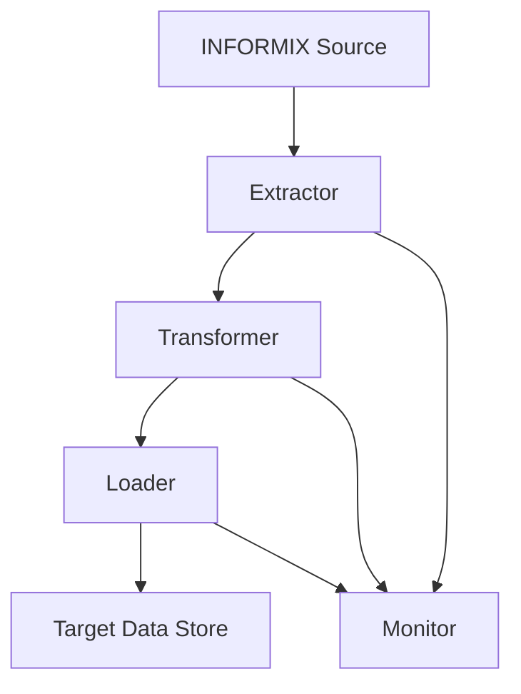

## Problem Summary
- The system must ingest, transform, and load data from INFORMIX databases into target systems.
- Challenges include handling schema evolution, ensuring data quality, and meeting processing SLAs.
- Data volume and velocity require scalable and fault-tolerant pipeline design.
- Acceptance criteria include correctness, timeliness, and monitoring capabilities.

## Proposed Approach
- Implement a modular ETL pipeline with distinct extraction, transformation, and loading stages.
- Use incremental data extraction to optimize performance and reduce load on source systems.
- Incorporate schema validation and data quality checks at each stage.
- Provide monitoring and alerting for pipeline health and SLA adherence.

## File-Level Plan
- extractor.py: Handles connection and incremental extraction from INFORMIX.
- transformer.py: Applies business logic, data cleansing, and schema validation.
- loader.py: Loads transformed data into target data stores.
- monitor.py: Implements health checks, logging, and alerting mechanisms.
- config.yaml: Configuration management for pipeline parameters and credentials.

## API / Interface Changes
- Introduce REST endpoints for pipeline status and metrics retrieval.
- Define webhook or callback interfaces for alert notifications.
- Provide CLI commands for manual pipeline control and troubleshooting.
- Ensure backward compatibility with existing monitoring tools.

## Constraints & SLAs
- Data freshness: Pipeline must complete processing within 2 hours of data availability.
- Availability: Pipeline uptime target of 99.9% monthly.
- Data quality: Zero tolerance for critical data errors; non-critical errors must be logged and alerted.
- Scalability: Support data volume growth up to 3x current levels without degradation.

## Risks & Trade-offs
- Trade-off between batch size and latency: Larger batches improve throughput but increase latency.
- Dependency on INFORMIX drivers and connectivity introduces potential points of failure.
- Schema changes require robust versioning and backward compatibility strategies.
- Rollback complexity in case of data corruption necessitates snapshot or backup strategies.

## Edge Cases
- Partial data availability due to source outages or network issues.
- Unexpected schema changes causing transformation failures.
- Duplicate or out-of-order data arriving during incremental extraction.
- Resource exhaustion scenarios impacting pipeline performance.

## Acceptance Checklist
- [ ] Successful end-to-end data ingestion and transformation with sample datasets.
- [ ] Automated data quality checks pass with zero critical errors.
- [ ] Pipeline completes within SLA timeframes under normal and peak loads.
- [ ] Monitoring dashboards and alerts configured and tested.
- [ ] Rollback and recovery procedures validated in staging.
- [ ] Documentation and runbooks completed and reviewed.

## Interfaces
- {'producer': 'Extractor module', 'consumer': 'Transformer module', 'protocol': 'In-memory data transfer / message queue', 'payload': 'Incremental data batches with schema metadata'}
- {'producer': 'Transformer module', 'consumer': 'Loader module', 'protocol': 'In-memory data transfer / message queue', 'payload': 'Cleaned and validated data records'}
- {'producer': 'Pipeline components', 'consumer': 'Monitoring system', 'protocol': 'REST API / Webhook', 'payload': 'Status updates, metrics, and alerts'}

## Trade-offs
- Batch size vs. latency: Larger batches improve throughput but increase processing delay; chosen moderate batch size for SLA balance.
- Technology dependency: Reliance on INFORMIX drivers may cause compatibility issues; mitigated by abstraction layers.
- Schema evolution handling: Strict validation reduces errors but requires more maintenance; chosen to prioritize data quality.
- Rollback complexity: Snapshot-based rollback chosen over incremental undo for simplicity despite higher storage costs.