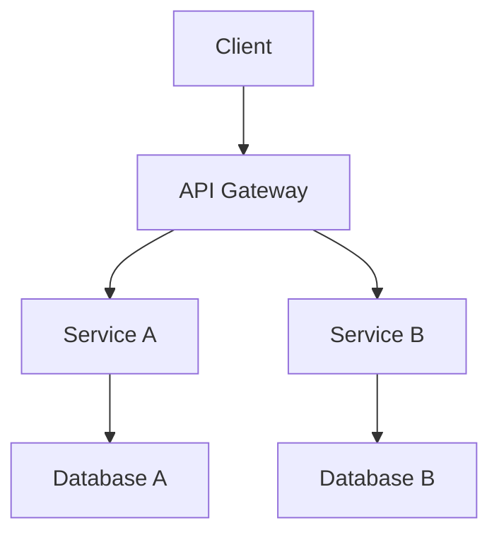

# Architecture Document

## Requirements
- **Functional Requirements (FR)**: Describe the features and functionalities that the system must support.
- **Non-Functional Requirements (NFR)**: Outline performance, security, and usability criteria.

## Architecture Diagram

## Components and Data Flow
- **Client**: The front-end application that interacts with the API.
- **API Gateway**: Routes requests to appropriate services.
- **Service A**: Handles user authentication and profile management.
- **Service B**: Manages content delivery.
- **Database A**: Stores user data.
- **Database B**: Stores content data.

## Storage, Indexing, and Caching
- Use relational databases for structured data storage.
- Implement caching strategies for frequently accessed data to improve performance.

## Failure Modes and Mitigations
- **Service Failure**: Implement retries and circuit breakers.
- **Database Outage**: Use read replicas and failover strategies.

## Observability
- **Metrics**: Track request counts, error rates, and response times.
- **Logs**: Centralized logging for troubleshooting.
- **Traces**: Distributed tracing to monitor request flows.

## Security and Privacy
- Implement OAuth 2.0 for authentication.
- Ensure data encryption in transit and at rest.

## Rollout Plan
- **Phase 1**: Deploy API Gateway and Service A.
- **Phase 2**: Deploy Service B and databases.

## Acceptance Checklist
- [ ] All components are documented.
- [ ] Risks are identified and mitigated.
- [ ] Performance criteria are defined.