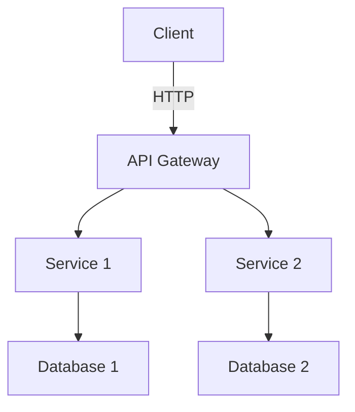

# Architecture Document

## Requirements
### Functional Requirements
- Define the core functionalities of the system.
### Non-Functional Requirements
- Performance, scalability, and security considerations.

## Architecture Diagram

## Components and Data Flow
- **Client**: Interacts with the API Gateway.
- **API Gateway**: Routes requests to appropriate services.
- **Service 1**: Handles user authentication and authorization.
- **Service 2**: Manages user data and interactions.
- **Databases**: Store user information and application data.

## Storage and Indexing
- Use of relational databases for structured data.
- Indexing strategies for fast data retrieval.

## Failure Modes and Mitigations
- **Service Failure**: Implement retries and fallbacks.
- **Database Outage**: Use caching strategies to minimize impact.

## Observability
- Metrics collection for performance monitoring.
- Logs for error tracking and debugging.
- Traces for request flow analysis.

## Security and Privacy
- Data encryption in transit and at rest.
- Regular security audits and compliance checks.

## Rollout Plan
- Staged rollout with monitoring at each phase.
- Rollback strategies in case of failures.

## Acceptance Checklist
- [ ] All functional requirements are met.
- [ ] Non-functional requirements are documented.
- [ ] Architecture diagram is complete and accurate.
- [ ] Risks and mitigations are identified.