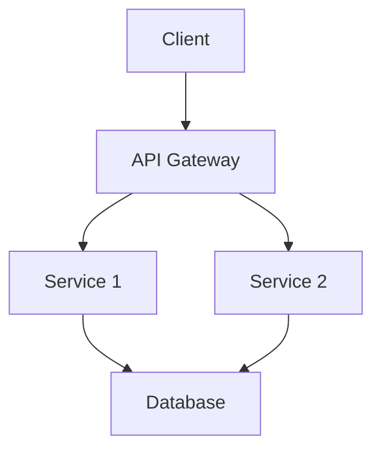

# Architecture Document

## Requirements
### Functional Requirements
- Clearly define the functionalities the system should provide.

### Non-Functional Requirements
- Performance, scalability, and security considerations.

## Architecture Diagram

## Components and Data Flow
- **Client**: Interacts with the API Gateway.
- **API Gateway**: Routes requests to appropriate services.
- **Service 1 & Service 2**: Handle business logic and interact with the database.
- **Database**: Stores application data.

## Storage, Indexing, and Caching
- Use of relational database for structured data.
- Caching layer for frequently accessed data to improve performance.

## Failure Modes and Mitigations
- Service downtime: Implement retries and circuit breakers.
- Data loss: Regular backups and replication.

## Observability
- Metrics: Track request counts, error rates, and response times.
- Logs: Centralized logging for debugging.
- Traces: Distributed tracing for performance monitoring.

## Security and Privacy
- Authentication and authorization mechanisms.
- Data encryption in transit and at rest.

## Rollout Plan
- Incremental rollout with feature flags to minimize risk.

## Acceptance Checklist
- [ ] All components documented.
- [ ] Security measures in place.
- [ ] Performance metrics defined.