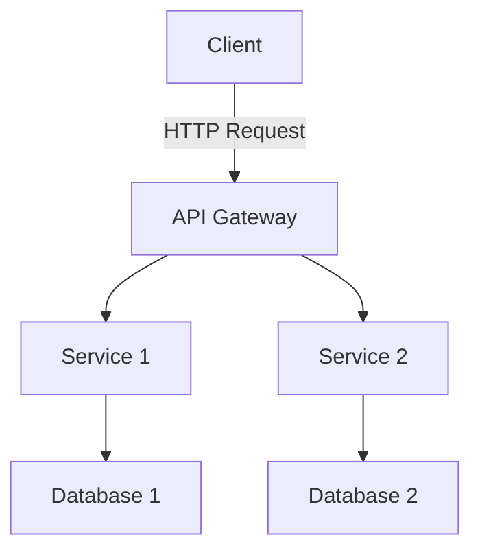

# Architecture Document

## Requirements
### Functional Requirements (FR)
- Define the core functionalities of the system.

### Non-Functional Requirements (NFR)
- Performance, scalability, and security requirements.

## Architecture Diagram

## Components and Data Flow
- **Client**: Interacts with the API Gateway.
- **API Gateway**: Routes requests to appropriate services.
- **Service 1**: Handles user authentication and profile management.
- **Service 2**: Manages data processing and storage.
- **Database 1**: Stores user data.
- **Database 2**: Stores application data.

## Storage, Indexing, and Caching
- Use of relational databases for structured data storage.
- Caching layer for frequently accessed data to improve performance.

## Failure Modes and Mitigations
- **Service Outage**: Implement retries and fallbacks.
- **Data Loss**: Regular backups and replication strategies.

## Observability
- Metrics collection for monitoring system performance.
- Logging for error tracking and debugging.

## Security and Privacy
- Authentication and authorization mechanisms in place.
- Data encryption in transit and at rest.

## Rollout Plan
- Staged deployment with monitoring for each phase.

## Acceptance Checklist
- [ ] All components documented.
- [ ] Risks and mitigations outlined.
- [ ] Performance metrics defined.