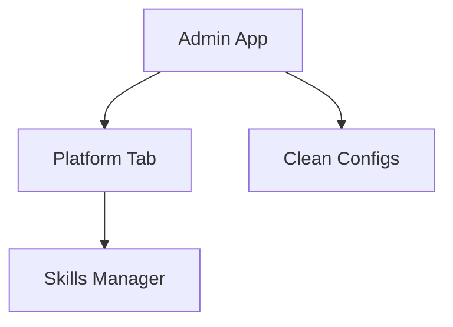

## Requirements
- Integrate Skills Manager into the Admin App under a new 'Platform' tab.
- Remove rolesRequired to ensure access for all administrators.
- Clean up configurations for manage.topcoder.com in both production and development.

## Architecture Diagram

## Risks
- Potential access control issues if rolesRequired is not properly managed.
- Configuration changes may lead to downtime if not tested adequately.

## Rollout Plan
1. Implement changes in a feature branch.
2. Conduct thorough testing to ensure existing functionality is not broken.
3. Deploy to production after validation.
4. Monitor for any issues post-deployment.

## Components
- {'name': 'Admin App', 'responsibility': 'Main interface for managing Topcoder resources.', 'tech': 'React, Redux'}
- {'name': 'Skills Manager', 'responsibility': 'Manage and display skills.', 'tech': 'React, API Integration'}

## Interfaces
- {'name': 'Admin App to Skills Manager', 'contract': 'GET /skills to fetch skills data'}
- {'name': 'Admin App to Configs', 'contract': 'GET /configs to retrieve configuration settings'}

## Trade-offs
- Removing rolesRequired increases accessibility but may expose sensitive features if not managed correctly.
- Cleaning up configurations improves maintainability but requires thorough testing to avoid service disruption.