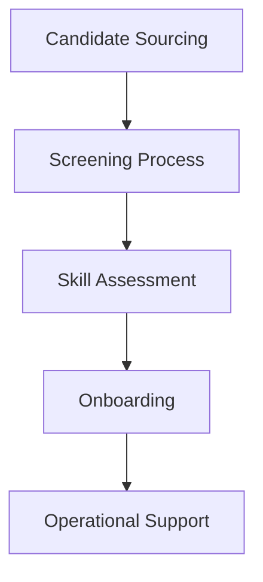

## Requirements
- Source native speakers in Japanese, Korean, and French for a 3-month contract.
- Full-time commitment (8 hours/day).

## Architecture Diagram

## Risks
- High turnover due to contract nature.
- Misalignment of expectations between candidates and operational needs.

## Rollout
1. Initiate candidate sourcing immediately.
2. Implement a streamlined screening and assessment process.
3. Onboard successful candidates by the weekend.
4. Monitor performance and gather feedback for future improvements.

## Components
- {'name': 'Candidate Sourcing', 'responsibility': 'Identify and attract qualified candidates.', 'tech': 'Job boards, recruitment platforms'}
- {'name': 'Screening Process', 'responsibility': 'Evaluate candidate profiles and shortlist for assessments.', 'tech': 'Applicant Tracking System'}
- {'name': 'Skill Assessment', 'responsibility': 'Conduct language proficiency and operational aptitude tests.', 'tech': 'Online assessment tools'}
- {'name': 'Onboarding', 'responsibility': 'Integrate candidates into operational teams.', 'tech': 'Collaboration tools, training materials'}
- {'name': 'Operational Support', 'responsibility': 'Provide ongoing language support and facilitate communication.', 'tech': 'Communication platforms'}

## Interfaces
- {'source': 'Candidate Sourcing', 'target': 'Screening Process', 'contract': 'Candidate profiles are sent for evaluation.'}
- {'source': 'Screening Process', 'target': 'Skill Assessment', 'contract': 'Shortlisted candidates are invited for assessments.'}
- {'source': 'Skill Assessment', 'target': 'Onboarding', 'contract': 'Successful candidates are onboarded into the team.'}
- {'source': 'Onboarding', 'target': 'Operational Support', 'contract': 'Candidates begin providing language support.'}

## Trade-offs
- Remote work allows for a wider talent pool but may complicate team integration.
- Short contract duration may limit deep operational understanding but allows for rapid scaling.