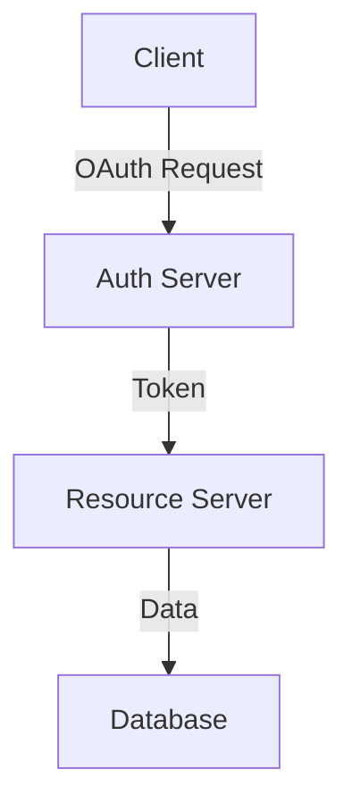

## Problem Summary
- Need for a scalable user authentication and authorization system supporting multiple tenants.

## Proposed Approach
- Utilize OAuth 2.0 and OpenID Connect for authentication.
- Implement role-based access control (RBAC) for authorization.

## Architecture Diagram

## Components
- **Auth Server** – Handles authentication requests and issues tokens.
- **Resource Server** – Validates tokens and serves protected resources.
- **Database** – Stores user data and tenant configurations.

## Interfaces
- **Auth API**: `POST /auth/login` (authenticates users)
- **Resource API**: `GET /resource` (returns protected data)

## Risks & Trade-offs
- **Risk**: Potential for token theft; **Mitigation**: Implement short-lived tokens and refresh tokens.
- **Trade-off**: Increased complexity with multi-tenancy management.

## Constraints & SLAs
- Must support 1000 concurrent users with a response time < 200ms.

## Acceptance Checklist
- [ ] Auth API implemented and tested.
- [ ] Resource API secured with RBAC.
- [ ] Documentation complete and reviewed.

## Components
- {'name': 'Auth Server', 'responsibility': 'Handles user authentication and issues tokens.', 'tech': 'Node.js, Express'}
- {'name': 'Resource Server', 'responsibility': 'Serves protected resources and validates tokens.', 'tech': 'Python, Flask'}
- {'name': 'Database', 'responsibility': 'Stores user and tenant data.', 'tech': 'PostgreSQL'}

## Interfaces
- {'api': 'Auth API', 'path': '/auth/login', 'method': 'POST', 'description': 'Authenticates users and returns tokens.'}
- {'api': 'Resource API', 'path': '/resource', 'method': 'GET', 'description': 'Returns protected user data.'}

## Trade-offs
- Using OAuth 2.0 simplifies integration with third-party services but adds complexity to the system.
- Multi-tenancy increases complexity but allows for better resource utilization.