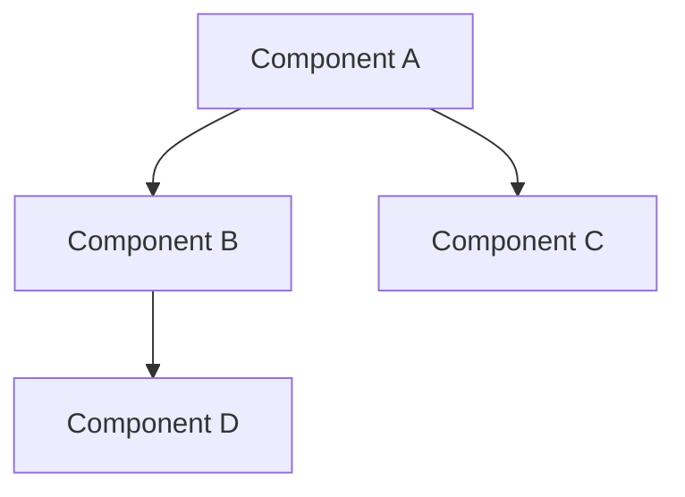

## Problem Summary
- Define the system's core functionality and user needs.

## Proposed Approach
- Outline the architecture with key components and their interactions.

## Architecture Diagram

## Components
- Component A: Handles user authentication.
- Component B: Manages data processing.
- Component C: Provides API endpoints.
- Component D: Stores data in a database.

## Interfaces
- Component A <-> Component B: REST API for data exchange.
- Component C <-> Component D: SQL queries for data retrieval.

## Risks & Trade-offs
- Risk of data inconsistency if components fail to communicate.
- Trade-off between performance and complexity in data processing.

## Acceptance Checklist
- All components are documented.
- Interfaces are clearly defined.
- Risks have been identified and mitigations proposed.

## Components
- {'name': 'Authentication Service', 'responsibility': 'Handles user login and token generation', 'tech': 'Node.js, Express'}
- {'name': 'Data Processing Service', 'responsibility': 'Processes incoming data and applies business logic', 'tech': 'Python, Flask'}
- {'name': 'API Gateway', 'responsibility': 'Routes requests to appropriate services', 'tech': 'NGINX'}
- {'name': 'Database', 'responsibility': 'Stores user and transaction data', 'tech': 'PostgreSQL'}

## Interfaces
- {'from': 'Authentication Service', 'to': 'Data Processing Service', 'protocol': 'REST', 'description': 'Authenticates users before processing data'}
- {'from': 'API Gateway', 'to': 'Data Processing Service', 'protocol': 'HTTP', 'description': 'Routes API calls to processing service'}
- {'from': 'Data Processing Service', 'to': 'Database', 'protocol': 'SQL', 'description': 'Stores processed data'}

## Trade-offs
- Using a microservices architecture increases complexity but allows for independent scaling.
- Choosing PostgreSQL provides strong consistency but may limit performance under heavy load.