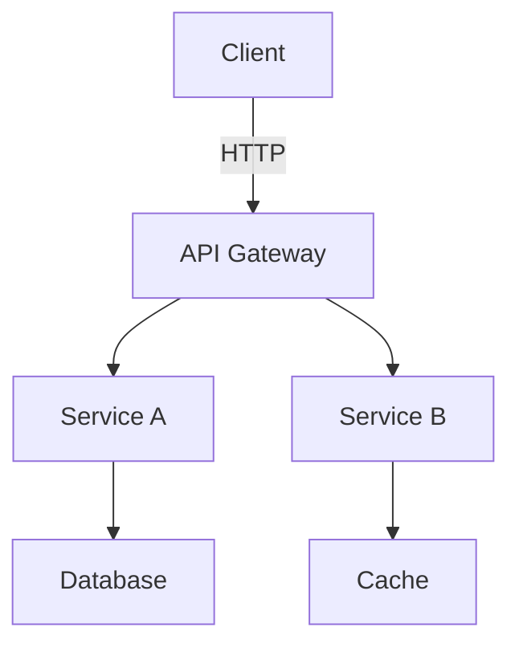

## Problem Summary
- Design a scalable architecture for a microservices-based application.

## Functional Requirements
- Handle 10,000 concurrent users.
- Support real-time data processing.

## Architecture Diagram

## Components
- **API Gateway**: Manages traffic and routing.
- **Service A**: Handles user authentication.
- **Service B**: Processes transactions.
- **Database**: Stores user and transaction data.
- **Cache**: Improves read performance.

## Interfaces
- API Gateway -> Service A (REST)
- API Gateway -> Service B (REST)
- Service A -> Database (SQL)
- Service B -> Cache (in-memory)

## Trade-offs
- Choosing REST over gRPC for simplicity vs performance.
- Using SQL for relational data vs NoSQL for flexibility.

## Risks
- Potential bottlenecks at the API Gateway.
- Data consistency challenges between services.

## Rollout Plan
1. Deploy API Gateway.
2. Roll out Service A.
3. Gradually introduce Service B with load testing.

## Acceptance Checklist
- All components deployed and tested.
- Performance benchmarks met.

## Components
- {'name': 'API Gateway', 'responsibility': 'Traffic management', 'tech': 'Nginx'}
- {'name': 'Service A', 'responsibility': 'User authentication', 'tech': 'Node.js'}
- {'name': 'Service B', 'responsibility': 'Transaction processing', 'tech': 'Python'}
- {'name': 'Database', 'responsibility': 'Data storage', 'tech': 'PostgreSQL'}
- {'name': 'Cache', 'responsibility': 'Improving read performance', 'tech': 'Redis'}

## Interfaces
- API Gateway -> Service A (REST)
- API Gateway -> Service B (REST)
- Service A -> Database (SQL)
- Service B -> Cache (in-memory)

## Trade-offs
- REST vs gRPC for API communication (simplicity vs performance)
- SQL vs NoSQL for data storage (structure vs flexibility)