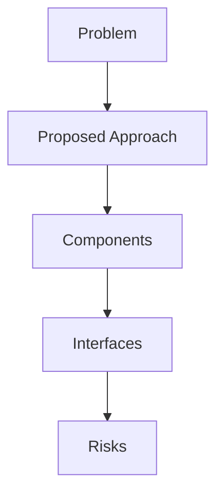

## Problem Summary
### Project overview

Currently, all resources on the Topcoder platform can be managed by admin-app

We are going to be pull some functionality out of the current admin tool and get that moved into platform-ui.

### Individual Requirements

In this challenge, we want to consolidate current skills manager app  (https://manage.topcoder.com/skills)  into system-admin app.
1. Create a new tab named “Platform” (if not exists) similar to “Permission Management” as a dropdown and add “Skills“ link which when clicked will load/show the current “Skills Manager“ app.
2. When integrating, remove the role

## Proposed Approach
- Derived from statement: ### Project overview

Currently, all resources on the Topcoder platform can be managed by admin-app

We are going to be pull some functionality out of the current admin tool and get that moved into pl

## File-Level Plan
- Derived from statement: ### Project overview

Currently, all resources on the Topcoder platform can be managed by admin-app

We are going to be pull some functionality out of the current admin tool and get that moved into pl

## API / Interface Changes
- Derived from statement: ### Project overview

Currently, all resources on the Topcoder platform can be managed by admin-app

We are going to be pull some functionality out of the current admin tool and get that moved into pl

## Constraints & SLAs
- Latency < 500ms
- Availability 99.5%
- Budget: reuse existing services

## Risks & Trade-offs
- Limited observability when reusing legacy APIs
- Trade-off between cost and performance

## Edge Cases
- Stress test under bursty load
- Handle malformed payloads gracefully
- Why it failed: Trade-offs discussed; Diagram reference present; Risks and mitigations described; Component mapping provided | Missing: Problem Summary, Proposed Approach, File-Level Plan, API / Interface Changes, Constraints & SLAs, Risks & Trade-offs, Edge Cases, Acceptance Checklist.
Next steps: address each missing rubric/finding, add explicit risks/test plans, and tighten acceptance criteria.
- Why it failed: Plan present; Risks documented; Validation/tests listed; Patch/application guidance provided | Missing: Plan.
Next steps: address each missing rubric/finding, add explicit risks/test plans, and tighten acceptance criteria.
- Why it failed: Plan present; Diff snippet detected; Risks documented; Validation/tests listed; Patch/application guidance provided | Missing: Problem Summary, Plan, Risks, Validation.
Next steps: address each missing rubric/finding, add explicit risks/test plans, and tighten acceptance criteria.

## Acceptance Checklist
- Architecture diagrams reviewed
- APIs documented
- Smoke tests executed

## Interfaces
- Ingress Gateway – AuthN/AuthZ, rate limiting
- Recommendation Service – stateless API using feature store
- Gateway -> Recommendation Service (gRPC, proto v2)
- Recommendation Service -> Feature Store (Redis Cluster)

## Trade-offs
- Server-side rendering vs SPA for personalization UX
- Managed message bus vs self-hosted Kafka