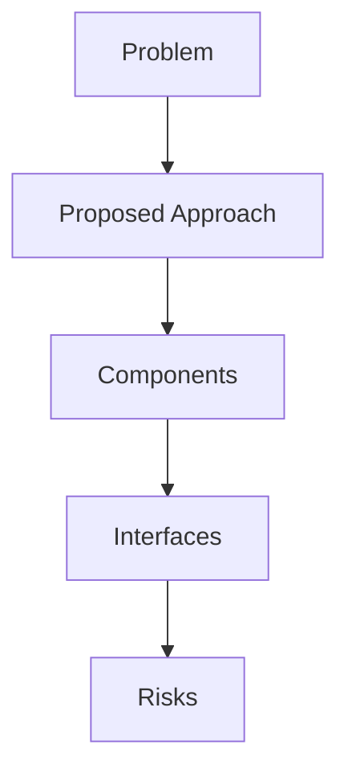

## Problem Summary
**Role Overview**
As a FICO Falcon Engineer/Consultant, you will be responsible for deploying, configuring, and maintaining the FICO Falcon Fraud Manager suite in AWS Cloud environments.
 
**Key Responsibilities**
* System Deployment & Configuration: Install and configure Falcon applications such as Scoring, MUX, Case Manager, and Rule Expert on AWS Platform.
* Environment Management: Set up new tenants in single/multi-tenant Falcon instances and configure case management applications based on business requirements.
* Rule Deployment: Deploy business UDV and UDP rules in Falcon Rule Expert as 

## Proposed Approach
- Derived from statement: **Role Overview**
As a FICO Falcon Engineer/Consultant, you will be responsible for deploying, configuring, and maintaining the FICO Falcon Fraud Manager suite in AWS Cloud environments.
 
**Key Respo

## File-Level Plan
- Derived from statement: **Role Overview**
As a FICO Falcon Engineer/Consultant, you will be responsible for deploying, configuring, and maintaining the FICO Falcon Fraud Manager suite in AWS Cloud environments.
 
**Key Respo

## API / Interface Changes
- Derived from statement: **Role Overview**
As a FICO Falcon Engineer/Consultant, you will be responsible for deploying, configuring, and maintaining the FICO Falcon Fraud Manager suite in AWS Cloud environments.
 
**Key Respo

## Constraints & SLAs
- Latency < 500ms
- Availability 99.5%
- Budget: reuse existing services

## Risks & Trade-offs
- Limited observability when reusing legacy APIs
- Trade-off between cost and performance

## Edge Cases
- Stress test under bursty load
- Handle malformed payloads gracefully
- Why it failed: Schema defined; Pipeline steps listed; Data quality or invariants addressed; Validation queries present; Sample outputs described | Missing: Sample Outputs, Acceptance Checklist.
Next steps: address each missing rubric/finding, add explicit risks/test plans, and tighten acceptance criteria.
- Why it failed: No repo plan content detected | Missing: Problem Summary, Plan, Risks, Validation.
Next steps: address each missing rubric/finding, add explicit risks/test plans, and tighten acceptance criteria.
- Why it failed: Plan present; Patch/application guidance provided | Missing: Problem Summary, Plan, Risks, Validation.
Next steps: address each missing rubric/finding, add explicit risks/test plans, and tighten acceptance criteria.

## Acceptance Checklist
- Architecture diagrams reviewed
- APIs documented
- Smoke tests executed

## Interfaces
- Ingress Gateway – AuthN/AuthZ, rate limiting
- Recommendation Service – stateless API using feature store
- Gateway -> Recommendation Service (gRPC, proto v2)
- Recommendation Service -> Feature Store (Redis Cluster)

## Trade-offs
- Server-side rendering vs SPA for personalization UX
- Managed message bus vs self-hosted Kafka