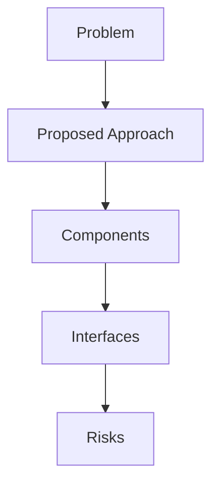

## Problem Summary
## Project Overview
The Identity Service project is used  to validate username / password logins, lookup roles, etc...  It's currently implemented in Java and targets MySQL/Informix.
We want to revise the project to use **TypeScript** and point to **Postgres** via **Prisma**, but **keep the functionalities untouched, such as redis cache, Kafka event bus, etc**.  

In previous challenges: [Topcoder Identity Service: revise using Typescript and Postgres](https://www.topcoder.com/challenges/6cf9672f-6a55-4043-8661-df9917bb3271),  [Topcoder Identity Service: updating User Resources with TypeScript

## Proposed Approach
- Derived from statement: ## Project Overview
The Identity Service project is used  to validate username / password logins, lookup roles, etc...  It's currently implemented in Java and targets MySQL/Informix.
We want to revise

## File-Level Plan
- Derived from statement: ## Project Overview
The Identity Service project is used  to validate username / password logins, lookup roles, etc...  It's currently implemented in Java and targets MySQL/Informix.
We want to revise

## API / Interface Changes
- Derived from statement: ## Project Overview
The Identity Service project is used  to validate username / password logins, lookup roles, etc...  It's currently implemented in Java and targets MySQL/Informix.
We want to revise

## Constraints & SLAs
- Latency < 500ms
- Availability 99.5%
- Budget: reuse existing services

## Risks & Trade-offs
- Limited observability when reusing legacy APIs
- Trade-off between cost and performance

## Edge Cases
- Stress test under bursty load
- Handle malformed payloads gracefully
- Why it failed: Schema defined; Pipeline steps listed; Data quality or invariants addressed; Validation queries present; Sample outputs described | Missing: Acceptance Checklist.
Next steps: address each missing rubric/finding, add explicit risks/test plans, and tighten acceptance criteria.
- Why it failed: Verifier rubric_architecture_doc score 0.0.
Next steps: address each missing rubric/finding, add explicit risks/test plans, and tighten acceptance criteria.
- Why it failed: Schema defined; Pipeline steps listed; Data quality or invariants addressed; Validation queries present | Missing: Test Strategy & Validation Queries, Sample Outputs, Acceptance Checklist.
Next steps: address each missing rubric/finding, add explicit risks/test plans, and tighten acceptance criteria.

## Acceptance Checklist
- Architecture diagrams reviewed
- APIs documented
- Smoke tests executed

## Interfaces
- Ingress Gateway – AuthN/AuthZ, rate limiting
- Recommendation Service – stateless API using feature store
- Gateway -> Recommendation Service (gRPC, proto v2)
- Recommendation Service -> Feature Store (Redis Cluster)

## Trade-offs
- Server-side rendering vs SPA for personalization UX
- Managed message bus vs self-hosted Kafka