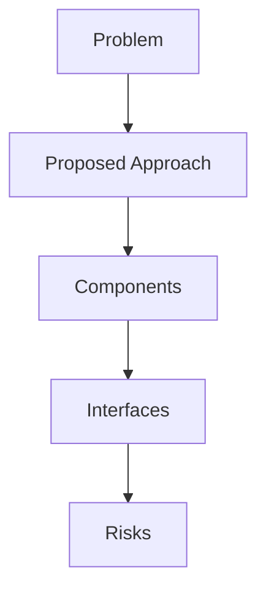

## Problem Summary
We’re seeking a highly skilled **Azure Integration Developer** for a **remote** full-time engagement. This is a 6-month opportunity, with the possibility of extension based on performance and project needs.. This role is ideal for a developer with solid experience designing and building enterprise-grade integrations using Microsoft Azure services such as Logic Apps, Functions, and API Management. You’ll work closely with architecture, engineering, and QA teams to build and support scalable, maintainable integration solutions.

## Key Responsibilities:

* Design, develop, and maintain integrati

## Proposed Approach
- Derived from statement: We’re seeking a highly skilled **Azure Integration Developer** for a **remote** full-time engagement. This is a 6-month opportunity, with the possibility of extension based on performance and project 

## File-Level Plan
- Derived from statement: We’re seeking a highly skilled **Azure Integration Developer** for a **remote** full-time engagement. This is a 6-month opportunity, with the possibility of extension based on performance and project 

## API / Interface Changes
- Derived from statement: We’re seeking a highly skilled **Azure Integration Developer** for a **remote** full-time engagement. This is a 6-month opportunity, with the possibility of extension based on performance and project 

## Constraints & SLAs
- Latency < 500ms
- Availability 99.5%
- Budget: reuse existing services

## Risks & Trade-offs
- Limited observability when reusing legacy APIs
- Trade-off between cost and performance

## Edge Cases
- Stress test under bursty load
- Handle malformed payloads gracefully
- Why it failed: Plan present; Patch/application guidance provided | Missing: Problem Summary, Plan, Risks, Validation.
Next steps: address each missing rubric/finding, add explicit risks/test plans, and tighten acceptance criteria.
- Why it failed: Schema defined; Pipeline steps listed; Data quality or invariants addressed; Validation queries present; Sample outputs described | Missing: Sample Outputs, Acceptance Checklist.
Next steps: address each missing rubric/finding, add explicit risks/test plans, and tighten acceptance criteria.
- Why it failed: No repo plan content detected | Missing: Problem Summary, Plan, Risks, Validation.
Next steps: address each missing rubric/finding, add explicit risks/test plans, and tighten acceptance criteria.

## Acceptance Checklist
- Architecture diagrams reviewed
- APIs documented
- Smoke tests executed

## Interfaces
- Ingress Gateway – AuthN/AuthZ, rate limiting
- Recommendation Service – stateless API using feature store
- Gateway -> Recommendation Service (gRPC, proto v2)
- Recommendation Service -> Feature Store (Redis Cluster)

## Trade-offs
- Server-side rendering vs SPA for personalization UX
- Managed message bus vs self-hosted Kafka