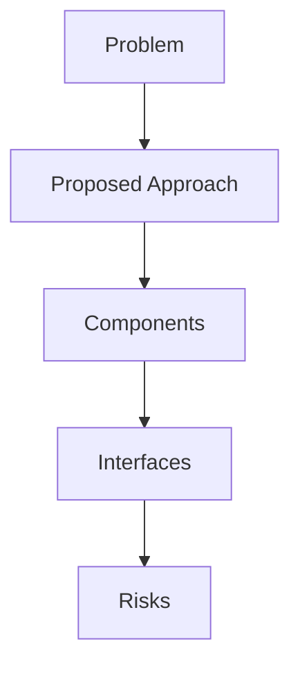

## Problem Summary
In this First2Finish challenge, we need to enhance the existing Review API (tc-review-api) to properly integrate with Challenge API and Resources API for the Active Reviews Page. The current endpoint doesn't fetch the correct pending reviews for users with different roles.

### Technology Stack

- Backend: Node.js with NestJS
- ORM: Prisma (with PostgreSQL)
- API Docs: OpenAPI/Swagger
- Package Manager: pnpm

### Required Links

- Review API (tc-review-api): https://github.com/topcoder-platform/tc-review-api.git
- Challenge API (challenge-api-v6):
  - source code: https://github.com/topcoder-p

## Proposed Approach
- Derived from statement: In this First2Finish challenge, we need to enhance the existing Review API (tc-review-api) to properly integrate with Challenge API and Resources API for the Active Reviews Page. The current endpoint 

## File-Level Plan
- Derived from statement: In this First2Finish challenge, we need to enhance the existing Review API (tc-review-api) to properly integrate with Challenge API and Resources API for the Active Reviews Page. The current endpoint 

## API / Interface Changes
- Derived from statement: In this First2Finish challenge, we need to enhance the existing Review API (tc-review-api) to properly integrate with Challenge API and Resources API for the Active Reviews Page. The current endpoint 

## Constraints & SLAs
- Latency < 500ms
- Availability 99.5%
- Budget: reuse existing services

## Risks & Trade-offs
- Limited observability when reusing legacy APIs
- Trade-off between cost and performance

## Edge Cases
- Stress test under bursty load
- Handle malformed payloads gracefully
- Why it failed: Schema defined; Pipeline steps listed; Data quality or invariants addressed; Validation queries present | Missing: Test Strategy & Validation Queries, Sample Outputs, Acceptance Checklist.
Next steps: address each missing rubric/finding, add explicit risks/test plans, and tighten acceptance criteria.
- Why it failed: Includes constraints/SLAs; Trade-offs discussed; Diagram reference present; Risks and mitigations described; Component mapping provided | Missing: Problem Summary, Proposed Approach, File-Level Plan, API / Interface Changes, Constraints & SLAs, Risks & Trade-offs, Edge Cases, Acceptance Checklist.
Next steps: address each missing rubric/finding, add explicit risks/test plans, and tighten acceptance criteria.
- Why it failed: Plan present; Risks documented; Validation/tests listed; Patch/application guidance provided | Missing: Plan.
Next steps: address each missing rubric/finding, add explicit risks/test plans, and tighten acceptance criteria.

## Acceptance Checklist
- Architecture diagrams reviewed
- APIs documented
- Smoke tests executed

## Interfaces
- Ingress Gateway – AuthN/AuthZ, rate limiting
- Recommendation Service – stateless API using feature store
- Gateway -> Recommendation Service (gRPC, proto v2)
- Recommendation Service -> Feature Store (Redis Cluster)

## Trade-offs
- Server-side rendering vs SPA for personalization UX
- Managed message bus vs self-hosted Kafka