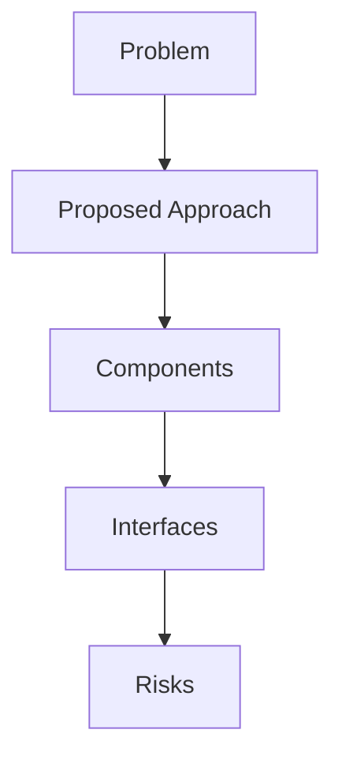

## Problem Summary
**Note: this is a fast challenge with shorter submission phase, review phase, you only need to integrate an API endpoint for a single page.** 

The Topcoder Review App currently uses mock data for displaying active challenges in the My Active Challenge Page. This challenge focuses on integrating real API functionality into this page by replacing the mock data with actual API calls to the Challenge API.

### Technology Stack

- Frontend:
  - React
  - TypeScript
  - SCSS + CSS Modules

### Assets

- Review App (platform-ui): https://github.com/topcoder-platform/platform-ui
- Challenge API (cha

## Proposed Approach
- Derived from statement: **Note: this is a fast challenge with shorter submission phase, review phase, you only need to integrate an API endpoint for a single page.** 

The Topcoder Review App currently uses mock data for di

## File-Level Plan
- Derived from statement: **Note: this is a fast challenge with shorter submission phase, review phase, you only need to integrate an API endpoint for a single page.** 

The Topcoder Review App currently uses mock data for di

## API / Interface Changes
- Derived from statement: **Note: this is a fast challenge with shorter submission phase, review phase, you only need to integrate an API endpoint for a single page.** 

The Topcoder Review App currently uses mock data for di

## Constraints & SLAs
- Latency < 500ms
- Availability 99.5%
- Budget: reuse existing services

## Risks & Trade-offs
- Limited observability when reusing legacy APIs
- Trade-off between cost and performance

## Edge Cases
- Stress test under bursty load
- Handle malformed payloads gracefully
- Why it failed: Schema defined; Pipeline steps listed; Data quality or invariants addressed; Validation queries present | Missing: Test Strategy & Validation Queries, Sample Outputs, Acceptance Checklist.
Next steps: address each missing rubric/finding, add explicit risks/test plans, and tighten acceptance criteria.
- Why it failed: Includes constraints/SLAs; Trade-offs discussed; Diagram reference present; Risks and mitigations described; Component mapping provided | Missing: Problem Summary, Proposed Approach, File-Level Plan, API / Interface Changes, Constraints & SLAs, Risks & Trade-offs, Edge Cases, Acceptance Checklist.
Next steps: address each missing rubric/finding, add explicit risks/test plans, and tighten acceptance criteria.
- Why it failed: Trade-offs discussed; Diagram reference present; Risks and mitigations described; Component mapping provided | Missing: Problem Summary, Proposed Approach, File-Level Plan, API / Interface Changes, Constraints & SLAs, Risks & Trade-offs, Edge Cases, Acceptance Checklist.
Next steps: address each missing rubric/finding, add explicit risks/test plans, and tighten acceptance criteria.

## Acceptance Checklist
- Architecture diagrams reviewed
- APIs documented
- Smoke tests executed

## Interfaces
- Ingress Gateway – AuthN/AuthZ, rate limiting
- Recommendation Service – stateless API using feature store
- Gateway -> Recommendation Service (gRPC, proto v2)
- Recommendation Service -> Feature Store (Redis Cluster)

## Trade-offs
- Server-side rendering vs SPA for personalization UX
- Managed message bus vs self-hosted Kafka