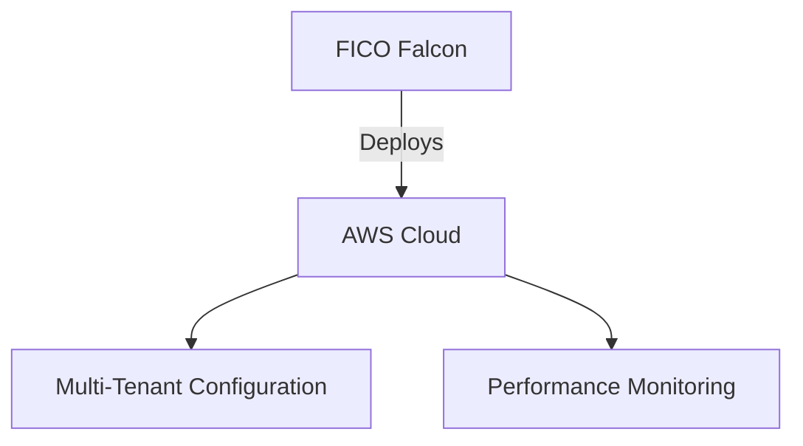

# FICO Falcon Fraud Manager Architecture

## Requirements
- Deploy FICO Falcon applications in AWS.
- Support multi-tenant configurations.

## Approach
- Utilize AWS services for deployment.
- Configure applications based on business requirements.

## Rollout
- Phased deployment strategy.

## Observability
- Implement logging and monitoring for application performance.

## Acceptance Checklist
- Successful deployment of Falcon applications.
- Performance benchmarks met.

## Interfaces
- {'producer': 'FICO Falcon Applications', 'consumer': 'AWS Services', 'protocol': 'HTTP/REST', 'payload': 'JSON'}

## Trade-offs
- Chosen AWS services over on-premise solutions for scalability.
- Multi-tenant architecture for cost efficiency at the expense of complexity.