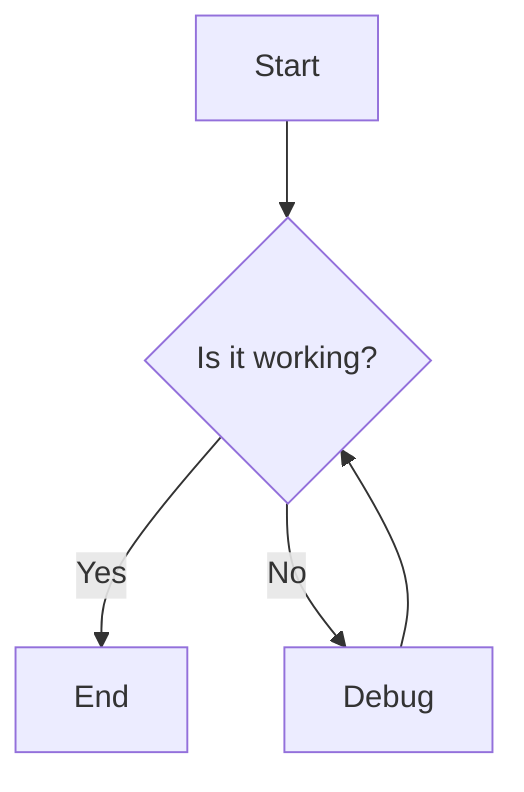

## Problem Summary

This section will describe the main objectives and goals of the 'test chlng' project.

## Proposed Approach

Outline the strategy to achieve the project goals, including methodologies and technologies to be used.

## File-Level Plan

1. **File A**: Description of changes and rationale.
2. **File B**: Description of changes and rationale.

## API / Interface Changes

List any changes to existing APIs or new APIs that will be introduced.

## Constraints & SLAs

Define any constraints that need to be adhered to and the service level agreements.

## Risks & Trade-offs

- **Risk 1**: Description and mitigation strategy.
- **Trade-off 1**: Description of the trade-off made and its implications.

## Edge Cases

List potential edge cases that should be handled in the implementation.

## Acceptance Checklist

- [ ] All objectives met.
- [ ] Documentation complete.
- [ ] Code reviewed and approved.

## Interfaces
- {'producer': 'Service A', 'consumer': 'Service B', 'protocol': 'HTTP', 'payload': 'JSON'}

## Trade-offs
- Choosing a microservices architecture for scalability vs. monolithic for simplicity.
- Using a third-party API for faster implementation vs. building an in-house solution for better control.