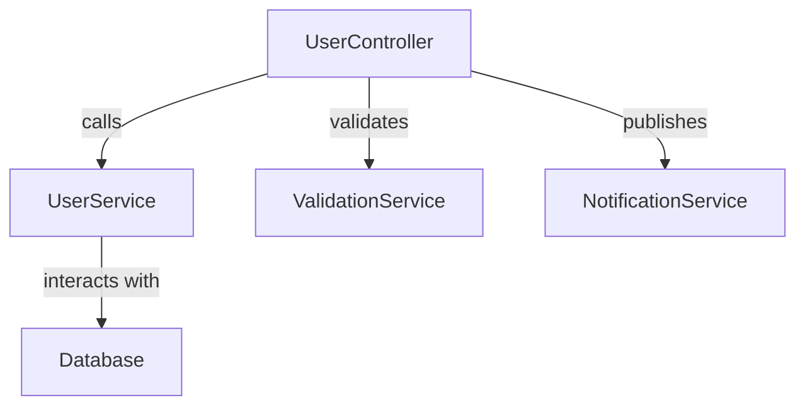

# Architecture Document

## Overview
This document details the changes required to align the UserController with the v3 Java implementation.

## Requirements
- Maintain existing functionalities while transitioning to TypeScript and PostgreSQL.
- Ensure compliance with the v3 Java code.

## Changes Required
1. Adjust permission checks to consider allowedScope.
2. Update DELETE and findUsers methods to match v3 logic.
3. Correct validation logic in registerUser method.
4. Implement profile validation in POST requests.
5. Remove unnecessary parameters and update logic as per v3 Java.

## Rollout Plan
- Implement changes in a feature branch.
- Conduct code reviews and testing.
- Merge into the main branch upon approval.

## Acceptance Criteria
- 13 out of 16 issues resolved to pass review.

## Risks
- Potential for introducing new bugs during the transition.
- Dependency on external services for testing.

## Interfaces
- {'producer': 'UserController', 'consumer': 'UserService', 'protocol': 'HTTP', 'payload': 'User data and commands'}

## Trade-offs
- Using TypeScript improves type safety but may require additional training for the team.
- Transitioning to PostgreSQL offers better performance but requires migration of existing data.