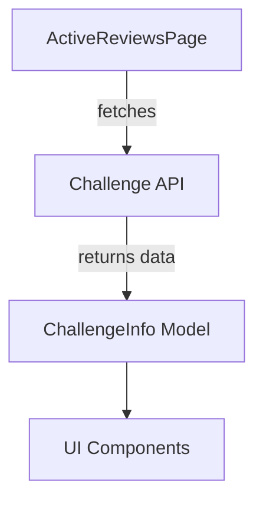

# Topcoder Review App API Integration

## Requirements
- Integrate Challenge API into My Active Challenge Page.

## Approach
- Replace mock data with real API calls.
- Implement error handling and loading states.
- Transform API response data.

## Rollout
- Deploy changes to the feat/review branch.

## Observability
- Monitor API call performance and error rates.

## Acceptance Checklist
- [ ] API calls integrated
- [ ] Error handling implemented
- [ ] Data transformation verified
- [ ] Documentation completed

## Interfaces
- {'producer': 'Challenge API', 'consumer': 'ActiveReviewsPage', 'protocol': 'HTTP', 'payload': 'Challenge data in JSON format'}

## Trade-offs
- Using real API data improves accuracy but may introduce latency.
- Implementing comprehensive error handling increases complexity but enhances user experience.