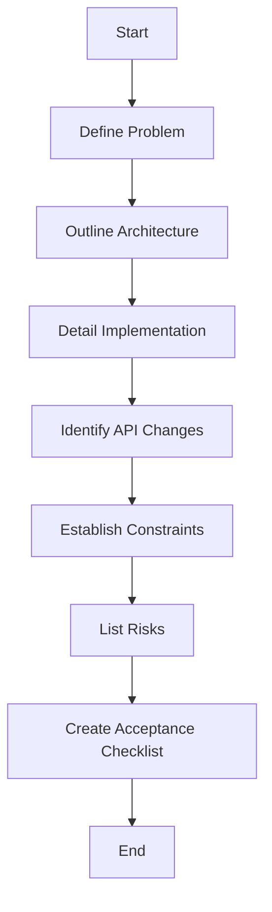

# Architecture Document

## Problem Summary
TBD – missing details

## Proposed Approach
TBD – missing details

## File-Level Plan
TBD – missing details

## API / Interface Changes
TBD – missing details

## Constraints & SLAs
TBD – missing details

## Risks & Trade-offs
TBD – missing details

## Acceptance Checklist
TBD – missing details

